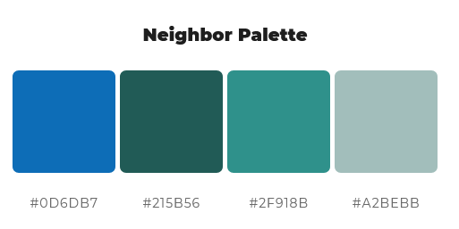
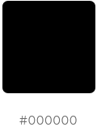
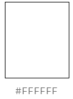
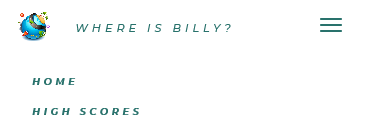
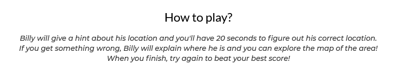
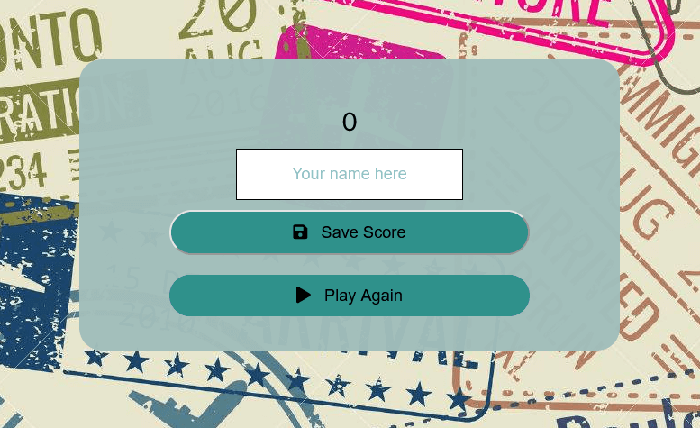

 <h1> Where is Billy?</h1>

<p align=center>Billy is terrible at linking famous landmarks around the world and their locations. He needs your help!<br>
 If you would like to test your geolocalization and landmarks knowledge, this game is for you! </p>


Click [here](https://nandabritto.github.io/MS2/index.html) to help Billy. 

## UX

### User Stories

+ As a user, I would like to be able to …

1.  easily navigate throughout the website and questions.
2.  see in which question I am answering and how many more I have;
3.  add my name and save my score;
4.  see how I rank on the High Scores.
5.  quickly check the High Scores when coming back to the game later on.

### 1. Strategy 

 * Project Purpose

    Create an interactive quiz with consistent styling across all pages ensuring that the application runs flawlessly across all devices. 

Project Goals

   + Provide a fun and interactive application;
   + Test general people knowledge about landmarks and places around the world;
   + Allow user to log scores and compare with previews attempts.


### 2. Scope

 * I wanted a simple, straightforward intuitive UX experience;
 * I wanted my content to be clear; 
 * A site that is visually appealing on most devices.


### 3. Structure

* A clear and simple layout is in place to ensure users can navigate intuitively and have an easy experience.
* Navbar is fixed on top to facilitate users to navigate through pages easily. Small navigation is the same on all pages to ensure easy navigation.
* Index page displays game and character introduction and instructions to the game. 
* Game page effectively shows one question, four answer options, countdown timer, and progress bar and text to show what question you are on.
* End game page can be found to add your name on your score. 
* High Scores page shows ranking scores.

### 4. Skeleton

Wireframes created with Balsamiq. The project was developed from initial wireframes and some modifications were made during the development process to assure better usability. 

Click to see wireframes:

[Index Page](assets/images/readme_screenshots/wireframegame_page.png) <br>
[Game Page](assets/images/readme_screenshots/wireframegame_page.png) <br>
[High Score Page](assets/images/readme_screenshots/wireframegame_page.png)

The end page was added later on project, on this way there's no wireframe of it.

### 5. Surface

* Colours

The Colour scheme was generated using eye dropper plugin, to get one colour from the logo image, and [mycolor.space](https://mycolor.space/) to generate the colour pallete.

<p align="center" width="100%">
  
</p>


<p>
Black color  was chosen to all game text and buttons, and also on footer text, to assure better readbility.</p>


<p>
  
White color was used on some buttons and navbar and footer background. </p>

* Font Selection
 
Two complimentary fonts were chosen with [Google Fonts](https://fonts.google.com/) to be used across the whole of the website.

The chosen fonts were Lato for headings, and navbar and Montserrat for lists, button and paragraphs.

## Existing Features 

### Navbar 

+ Fixed Navbar with Home and High Scores button to allow the user easy access to all pages. 

<p align="center" width="100%">
  
</p>

+ Colapsed navbar on smaller devices to wrap in all options and assure better navbar design.
<p align="center" width="100%">
  </p>

### Introduction page 

+ Game introduction to allow user to know the main character and play buton to begin game.
<p align="center" width="100%">
  </p>

+ Shortly game instruction to assure that user can play the game without doubts and easily. 
<p align="center" width="100%">
  </p>

### Game Page 

The game container has a contdown timer to limit answering time in 20 seconds.
<p align="center" width="100%">
  </p>

Each question has its own hint image to help user remember what landmark the question is linked. 
<p align="center" width="100%">
  </p>

When user got a wrong question or time finished, a modal shows a brief explanation about the question and a google maps with correct location. 
<p align="center" width="100%">
  </p>

Google maps have all user controls available. 

### End Game 

+ After answer 10 quiz questions, user can add name to rank score on High Scores page.
<p align="center" width="100%">
  </p>

### High Scores

+ A list of top 5 players can be found and every time user plays the game (on the same device) the new score will be added on it. 

<p align="center" width="100%">
  </p>

+ There is also a go home button that leads the user to the index page after check the high score list.
   
## Future Features 

I would like to add:

+ more questions to question bank and storage it on an API;
+ choose a difficult option;
+ sound effects to enhance the user experience;
+ external storage for ranking;
+ option to know more about the question even if the user answers it correctly.

## Technologies Used

### Languages Used

   + HTML5
   + CSS3
   + JQuery
   + JavaScript

 ### Frameworks, Libraries & Programs Used

   + Balsamiq:
        Balsamiq was used to create the wireframes during the design process.
   + Bootstrap 4.6:
        Bootstrap was used to assist with the navbar responsiveness.
   + Favicon generator:
        Used to create favicon used on the website.
   + Font Awesome:
        Font Awesome was used on all pages to add icons for aesthetic and UX purposes.
   + jQuery:
        JQuery came with Bootstrap to make the navbar responsive.
   + Git
        Git was used for version control by utilizing the Gitpod terminal to commit to Git and Push to GitHub.
   + GitHub:
        GitHub is used to store the projects code after being pushed from Git.
   + Google Fonts:
        Google fonts used to add fonts for aesthetic and UX purposes.
   + Google Maps Platform APIs:
        Google Maps API was used to add map and pin on each explanation about locations explored on questions game.
   + Grammarly:
        Used to correct any mistakes on readme and game text. 

## Code Validation

### Automated tests

   + HTML

  Passing the HTML from all templates and base into the W3C Markup Validator no errors or warnings have been found [W3C validator](https://validator.w3.org/).
  
  Code Validation results:
  
[Index Page](assets/images/readme_screenshots/validation_index.png) <br>
[Game Page](assets/images/readme_screenshots/validation_game.png) <br>
[End Page](assets/images/readme_screenshots/validation_end.png) <br>
[High Scores Page](assets/images/readme_screenshots/validation_index.png)

   + CSS

No errors were found when passing through the official [W3C validator](https://jigsaw.w3.org/css-validator/). 

6 warnings were found on the validation process. Five of them about custom properties were used to ensure that DRY principle was upheld and all warnings concerns the root colours code and two about imported style sheet from Google Fonts. 

CSS validation results can be viewed [here](assets/images/readme_screenshots/validation_css.png)

<a href="http://jigsaw.w3.org/css-validator/check/referer">
        
    </a>

+ JavaScript

I have tested both javascript files with the jshint and no error were been found. 

Reports can be found on links:

[script.js](assets/images/readme_screenshots/jshint_script_report.png) &nbsp; 
[end.js](assets/images/readme_screenshots/jshind_end_report.png) &nbsp; 
[highscores.js](assets/images/readme_screenshots/jshint_highscores_report.png)

### Manual Testing

   + Desktop

 Mozilla Firefox, Google Chrome, Microsoft Edge: everything is working good. Page loads and all of the page features are working.

   + Mobile
 
 Tested with Xiaomi Mi6, Xiaomi Mi8, Samsung J8, Samsumg A30 and Iphone X and webpage works well. It is responsive as intended and with no page deformations.

   + Mozilla Dev Tools
 
 Tested for available devices, webpage works well. It is responsive as intended, with no page deformations.
 
 ## Accessibility tests
 
 The entire website was verified about accessibility using [Wave](https://wave.webaim.org/). 

The error and alerts for each page can be viewed on the links:

[Index page](assets/images/readme_screenshots/accessibilitytest_index.png) &nbsp;
[Game Page](assets/images/readme_screenshots/accessibilitytest_gamepage.png) &nbsp; 
[End Page](assets/images/readme_screenshots/accessibilitytest_endpage.png) &nbsp; 
[High scores Page](assets/images/readme_screenshots/accessibilitytest_highscorepage.png)

   + Error

   - Empty button - A bootstrap navbar was used on this game, and, in smaller devices the navbar button have no text on it, just an icon to cick and revels navbar container. 

 + Alerts

    - The redundant link alert showed in all the pages was a design choice, to allow the user easy access (reload the page).
    - The small texts alerts showed on all pages were used by design choice to footer and source credits for the texts.

 
 ## Project Bugs and Solutions:

+ Timer 

There was an issue with the countdown timer  - When the user clicks an answer (correct or not) timer did not stop and if the user didn't click the next button, the error container opened showing an explanation about the question that should open only if a wrong answer clicked. 
I solve this bug by adding a clear interval on SelectedAnswer function. 

```
 
function selectedAnswer(a) {
    const selectedButton = a.target;
    const correct = selectedButton.dataset.correct;
    clearInterval(timer);
        if (correct) {
        this.classList.add('correct');
        scorePoints++;
        // add class if incorrect
    } else {
        this.classList.add('wrong');
        wrongAnswer();
    }
      Array.from(choiceButtons.children).forEach(button => {
        button.disabled = true;
    });
}

```

+ 11th question load 

When the user clicks the nextButton on the last question (10th), it is correctly redirected to the end.html page, but a new question is also rendering. 
This bug will be solved in the next version of the game. 

+ ClearStorage button 

On the initial code is possible to find a clear storage button on the High Scores page. Were tried several functions and it was still not working properly. Then, this button was removed from HTML and this bug will be solved and the clear button will be added in future releases.

+ Game container in smaller screens

During tests were noticed that on smaller screens (like iPhone 5) game page wasn't user friendly because the user needed to scroll down to click the next button or check google maps. This bug was solved adding special @media screen and (max-width: 365px).
 
```

@media screen and (max-width: 320px) {

    h1 {
        padding-top: 0 !important;
    }

    .navbar .navbar-brand {
        font-size: 0.6em;
    }

    .container {
        width: 95%;
    }

    #hint-image {
        width: 55%;
        margin: 0 auto;
    }

    #timer {
        font-size: small;
        margin: 3px auto;
    }

    #question {
        font-size: 1em;
        height: 45px;
    }

    .button {
        font-size: 1em;
    }

    #choice-container {
        left: 5%;
        position: unset;
    }

    #progress-text {
        font-size: x-small;
    }
}

```

Click [here](assets/images/readme_screenshots/bug_smallerscreens.png) to access this bug screenshots and [here](assets/images/readme_screenshots/bugsolved_smallerscreens.png) for solution after media screen adition. 

  ## Deployment

 The site was deployed to GitHub pages. 
 
 * The steps to deploy are as follows: 

  - In the GitHub repository, navigate to the Settings tab; 
  - From the source section drop-down menu, select the Master Branch;
  - Once the master branch has been selected, the page will be automatically refreshed with a detailed ribbon display to indicate the successful deployment. 

The live link can be found [here](https://nandabritto.github.io/MS2/).

### Forking the GitHub Repository:

By forking the GitHub Repository you will be able to make a copy of the original repository on your own GitHub account allowing you to view and/or make changes without affecting the original repository by using the following steps:

1. Log in to GitHub and locate the [GitHub Repository](https://github.com/nandabritto/MS2)
2. At the top of the Repository (not top of page) just above the "Settings" Button on the menu, locate the "Fork" Button.
3. You should now have a copy of the original repository in your GitHub account.

### Making a Local Clone

1. Log in to GitHub and locate the [GitHub Repository](https://github.com/nandabritto/MS2)
2. Under the repository name, click "Clone or download".
3. To clone the repository using HTTPS, under "Clone with HTTPS", copy the link.
4. Open Git Bash
5. Change the current working directory to the location where you want the cloned directory to be made.
6. Type `git clone`, and then paste the URL you copied in Step 3.

```
$ git clone https://github.com/nandabritto/MS2
```

7. Press Enter. Your local clone will be created.

## Credits 

### Content

 + All quiz questions were created based on two free night quiz web pages. The links can be found here:

[RadioTimes](https://www.radiotimes.com/quizzes/pub-quiz-geography/) <br>
[Khon Kaen Quiz](https://www.kkquiz.com/category/landmarks/1)

Questions were modified to attend character and game characteristics. 

+ Text explanations about questions are from Wikipedia.  

### Media

- All pictures and images used in this project are from [Depositphotos](https://depositphotos.com) and [freepik](https://www.freepik.com/home).

### Worked based on other code

+ [Web Dev Simplified](https://www.youtube.com/watch?v=riDzcEQbX6k) – Used to help with the first basic quiz function on JS. 
+ [James Q Quick Youtube Channel](https://www.youtube.com/watch?v=4bctmtuZVcM) - Used to help with the many quiz function on JS (like timer, progress bar, etc). 
+ [W3 Schools](https://www.w3schools.com) - Used to help building several functions like [error popup](https://www.w3schools.com/howto/howto_js_popup.asp).
+ [FreeCodeCamp](https://www.freecodecamp.org/news/how-to-keep-your-footer-where-it-belongs-59c6aa05c59c/) - Used to help with footer localization on pages.
+ [Bootstrap](https://getbootstrap.com/docs/4.0/components/navbar/) - Used to help building collapsed navbar.


### Acknowledgements

- To the Code Institute course material, as the basis of all my knowledge, is from here.
- To the Slack community as I have used the different channels to find answers to problems!
- Stack Overflow as a valuable resource for solving a couple of issues.
- [W3schools](https://www.w3schools.com/) for general reference.

I would also like to thank:

- My husband Guilherme for all the support on stressful moments, help to figure out some bugs and for reviewing everything. 
- My mentor Rahul Lakhanpal for his time, support and guidance.
- Code institute tutors, for help with several issues and bugs.


